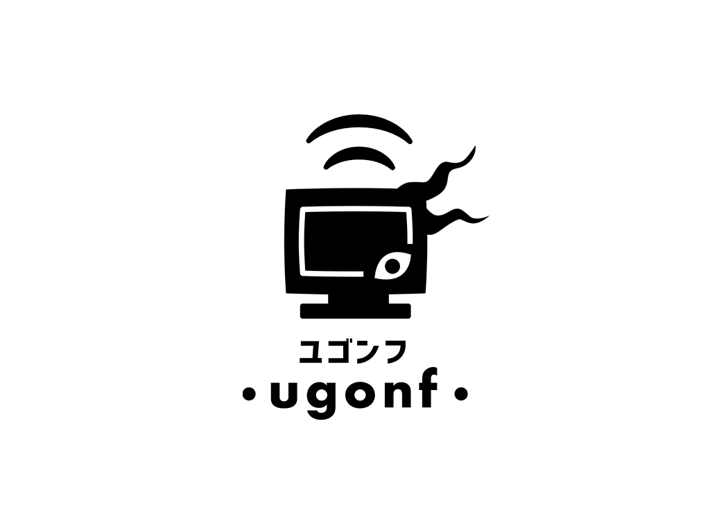

# ugonf

## 重要なお知らせ

> `1.3.0-rc.1` アップデートから、音声機能が廃止されました。
> これはいわゆる「ミラー配信」などの好ましくない使用が懸念されたことによる対応です。
> ご了承下さい。

> `1.2.0` アップデートから、 ugonf の利用には SkyWay の API Key が必要になります。
> API Key の取得および SkyWay アカウントの登録に関して、 ugonf からのサポートは行われません。
> ご了承ください。
>
> SkyWay アカウントの登録は[こちら](https://console-webrtc-free.ecl.ntt.com/users/registration)です。

----

<table style="text-align: center">
  <thead>
    <tr>
      <th >ダイレクトアクセス</th>
      <td>
        各種ソースの設定画面に直接ジャンプします
      </td>
    </tr>
  </thead>
  <tbody>
    <tr>
      <th>
        <a href="https://karasutatehi.github.io/ugonf/sender/media">
          カメラ
        </a>
      </th>
      <td>
        WebカメラやVtubeStudioなどの（仮想）カメラ
      </td>
    </tr>
    <tr>
      <th>
        <a href="https://karasutatehi.github.io/ugonf/sender/display">
          画面
        </a>
      </th>
      <td>
        モニター映像、ウィンドウ、ブラウザタブなど
      </td>
    </tr>

  </tbody>
</table>

---

**ugonf**（ユゴンフ）は、[WebRTC](https://webrtc.org/)を利用した、P2P 方式の映像共有アプリです。

## 仕様

### 共通

- 映像
  - 解像度: 1920 x 1080
  - フレームレート: 30FPS
  - コーデック: VP9

### Media

- 対応機材
  - Web カメラ
  - 仮想カメラ
    - [VTube Studio](https://store.steampowered.com/app/1325860/VTube_Studio/)
    - [Animaze](https://store.steampowered.com/app/1364390/Animaze_by_FaceRig/)
    - [OBS Studio](https://obsproject.com/)
    - [Streamlabs OBS](https://streamlabs.com/)
  - キャプチャーボード

### Display

- 範囲
  - モニター
  - ウィンドウ
  - ブラウザタブ

## 使い方

### 映像送信側

1. 「[https://karasutatehi.github.io/ugonf/](https://karasutatehi.github.io/ugonf/)」にアクセスします
2. ブラウザがデバイスの使用許諾を求めてくるので、承諾します
3. 「送信ソース」から「カメラ」または「画面」をクリックして設定画面に移動します
4. 「送信ソース」ごとに設定を行います
   - 「カメラ」の場合: 「カメラソース」で送信するデバイスを選択します
   - 「画面」の場合: 「画面ソース」の「選択」で送信する範囲を選択します
5. 「API キー」に SkyWay の API キーを入力します
6. 「ニックネーム」に固有の名前を入力します
7. 「送信」または「停止」をクリックして映像送信を開始・停止を制御します
   - 送信時にクリップボードにブラウザソース用リンクをコピーします
   - 送信時に確認ダイアログが表示され、「OK」をクリックすることではじめて映像送信が開始されます

### 映像受信側

1. [映像送信側](#映像送信側)から受け取ったリンクを使って、[OBS Studio](https://obsproject.com/)や[Streamlabs OBS](https://streamlabs.com/)のブラウザソースとして、配信ソフトウェアに直接取り込むことができます

- [映像送信側](#映像送信側)が映像を変更した場合、ページを更新する必要があります

## 規格

- 音声
  - コーデック: opus
- 映像
  - 解像度: 1280 x 720
  - フレームレート: 30 FPS
  - コーデック: VP9

## 動作環境

[SkyWay の FAQ](https://support.skyway.io/hc/ja/articles/115015688708)をご確認ください。

## クレジット

- 開発者
  - [KarasuTatehi](https://github.com/KarasuTatehi) - [Discord](https://discord.com/invite/AQWkzRCF5W) / [Twitch](https://www.twitch.tv/karasutatehi) / [Twitter](https://twitter.com/KarasuTatehi) / [YouTube](https://www.youtube.com/channel/UCN5Hd3p1cKdvWmoifnVK9oA) / [公式 HP](https://virtual-circle-aurora.github.io/talents/karasu-tatehi)
  - YØT from 81NO - [Twitter](https://twitter.com/SandR_YOT)
  - [AmenoAtsuta](https://github.com/AmenoAtsuta) - [Twitter](https://twitter.com/AmenoAtsuta) / [YouTube](https://www.youtube.com/channel/UCcNBKvsZBMPMJTwNaraELHg)
- ファビコン
  - masa_king - [coconala](https://coconala.com/users/239060)
- 発注
  - 喫茶ユゴス - [Twitter](https://twitter.com/cafeyuggoth) / [YouTube](https://www.youtube.com/channel/UC778fxfe9aXazW0AXLyOIpg) / [公式 HP](https://w.atwiki.jp/cafe-yuggoth/)
    - 宮古ミーゴ - [Twitter](https://twitter.com/Cutoluruhu_migo) / [YouTube](https://www.youtube.com/channel/UCCwedbOIXxubr7_d2-7bM3g)

## ライセンス

ソースコードは、[クリエイティブ・コモンズ 表示-継承 4.0 国際ライセンス](https://creativecommons.org/licenses/by-sa/4.0/deed.ja)の下で利用可能です。

[Creative Commons](https://creativecommons.org/)公式文書をご確認ください。

- 日本語 - [概要](https://creativecommons.org/licenses/by-sa/4.0/deed.ja) / [利用許諾条項](https://creativecommons.org/licenses/by-sa/4.0/legalcode.ja)
- English - [Deed](https://creativecommons.org/licenses/by-sa/4.0/deed) / [Legal code](https://creativecommons.org/licenses/by-sa/4.0/legalcode)
